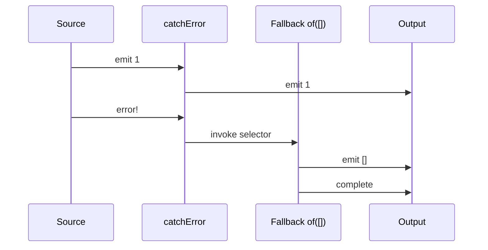

## Flow Diagram


```mermaid
sequenceDiagram
  participant S as Source
  participant C as catchError
  participant F as Fallback of([])
  participant O as Output
  S->>C: emit 1
  C->>O: emit 1
  S->>C: error!
  C->>F: invoke selector
  F->>O: emit []
  F->>O: complete
```
```
