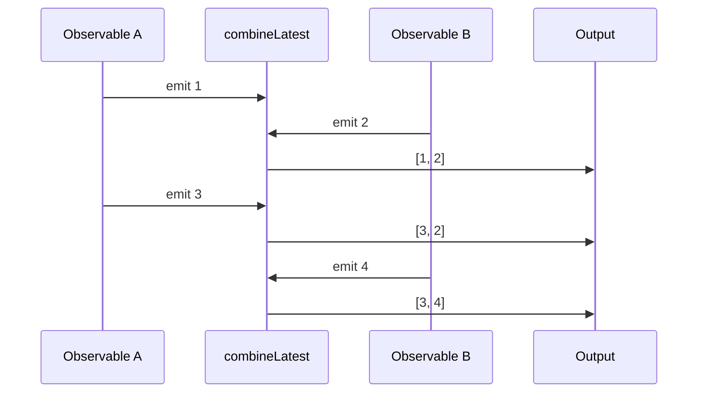

## Flow Diagram


```mermaid
sequenceDiagram
  participant A as Observable A
  participant C as combineLatest
  participant B as Observable B
  participant O as Output
  A->>C: emit 1
  B->>C: emit 2
  C->>O: [1, 2]
  A->>C: emit 3
  C->>O: [3, 2]
  B->>C: emit 4
  C->>O: [3, 4]
```
```
