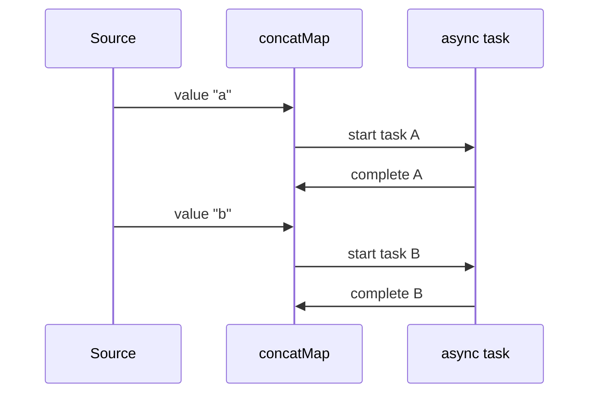

## Flow Diagram


```mermaid
sequenceDiagram
  participant S as Source
  participant C as concatMap
  participant A as async task
  S->>C: value "a"
  C->>A: start task A
  A->>C: complete A
  S->>C: value "b"
  C->>A: start task B
  A->>C: complete B
```
```
