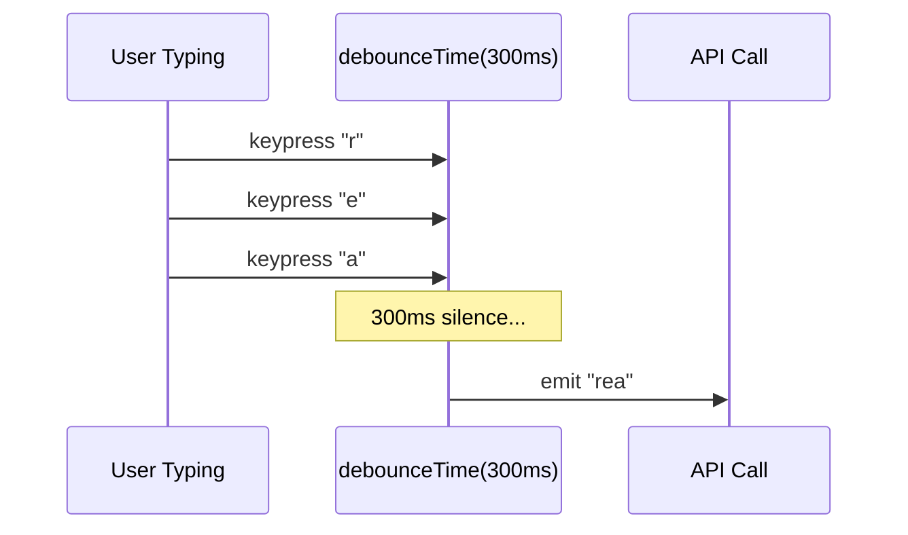

## Flow Diagram


```mermaid
sequenceDiagram
  participant U as User Typing
  participant D as debounceTime(300ms)
  participant A as API Call
  U->>D: keypress "r"
  U->>D: keypress "e"
  U->>D: keypress "a"
  Note over D: 300ms silence...
  D->>A: emit "rea"
```
```
