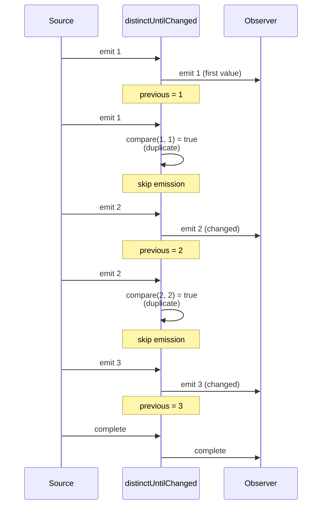

## Flow Diagram

```mermaid
sequenceDiagram
    participant Source
    participant Operator as distinctUntilChanged
    participant Observer
    
    Source->>Operator: emit 1
    Operator->>Observer: emit 1 (first value)
    Note over Operator: previous = 1
    
    Source->>Operator: emit 1
    Operator->>Operator: compare(1, 1) = true<br/>(duplicate)
    Note over Operator: skip emission
    
    Source->>Operator: emit 2
    Operator->>Observer: emit 2 (changed)
    Note over Operator: previous = 2
    
    Source->>Operator: emit 2
    Operator->>Operator: compare(2, 2) = true<br/>(duplicate)
    Note over Operator: skip emission
    
    Source->>Operator: emit 3
    Operator->>Observer: emit 3 (changed)
    Note over Operator: previous = 3
    
    Source->>Operator: complete
    Operator->>Observer: complete
```
