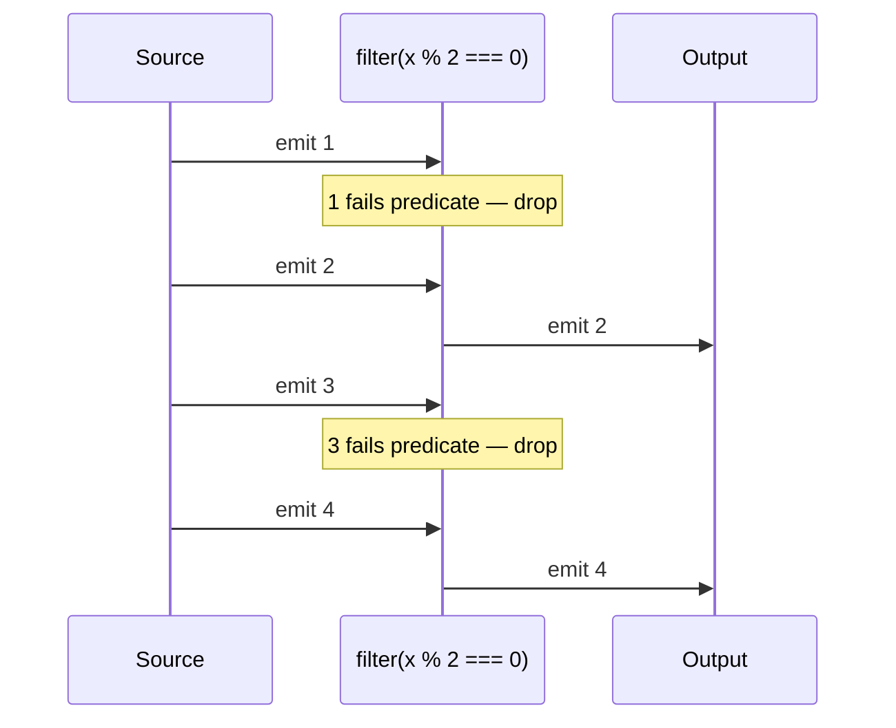

## Flow Diagram

```mermaid
sequenceDiagram
  participant S as Source
  participant F as filter(x % 2 === 0)
  participant O as Output
  S->>F: emit 1
  Note over F: 1 fails predicate — drop
  S->>F: emit 2
  F->>O: emit 2
  S->>F: emit 3
  Note over F: 3 fails predicate — drop
  S->>F: emit 4
  F->>O: emit 4
```
