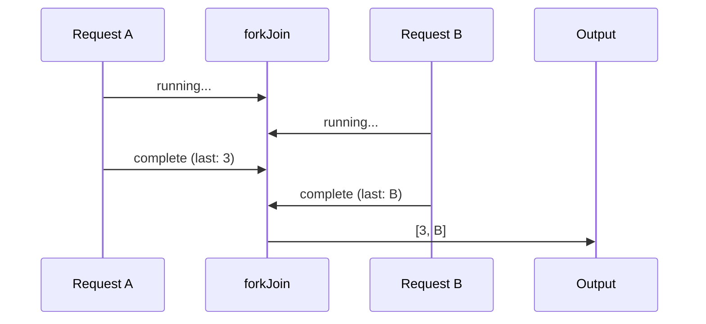

## Flow Diagram


```mermaid
sequenceDiagram
  participant A as Request A
  participant F as forkJoin
  participant B as Request B
  participant O as Output
  A->>F: running...
  B->>F: running...
  A->>F: complete (last: 3)
  B->>F: complete (last: B)
  F->>O: [3, B]
```
```
