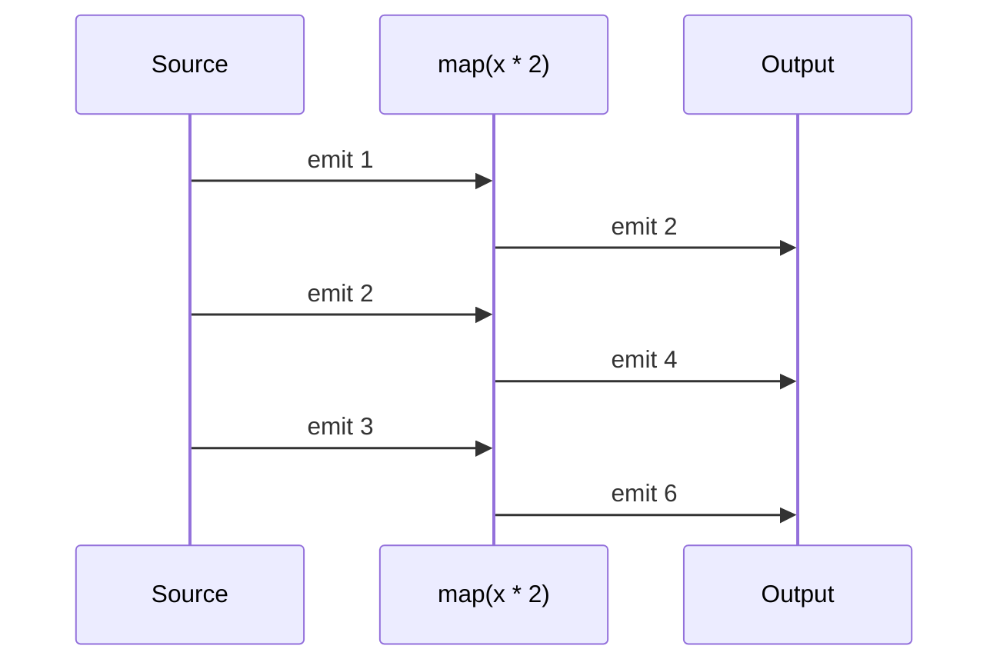

## Flow Diagram

```mermaid
sequenceDiagram
  participant S as Source
  participant M as map(x * 2)
  participant O as Output
  S->>M: emit 1
  M->>O: emit 2
  S->>M: emit 2
  M->>O: emit 4
  S->>M: emit 3
  M->>O: emit 6
```
