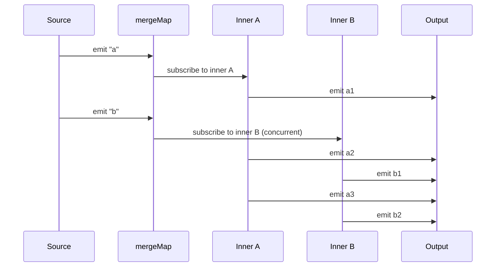

## Flow Diagram

```mermaid
sequenceDiagram
  participant S as Source
  participant M as mergeMap
  participant A as Inner A
  participant B as Inner B
  participant O as Output
  S->>M: emit "a"
  M->>A: subscribe to inner A
  A->>O: emit a1
  S->>M: emit "b"
  M->>B: subscribe to inner B (concurrent)
  A->>O: emit a2
  B->>O: emit b1
  A->>O: emit a3
  B->>O: emit b2
```
