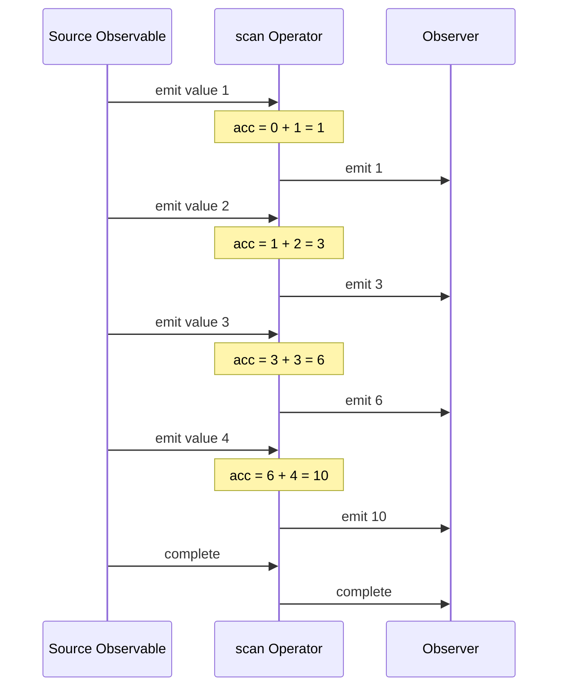

# scan

The `scan` operator applies an accumulator function to each value from the source Observable, storing intermediate results and emitting each accumulated value. It's similar to `reduce` but emits every intermediate accumulation rather than just the final result.

## Flow Diagram

