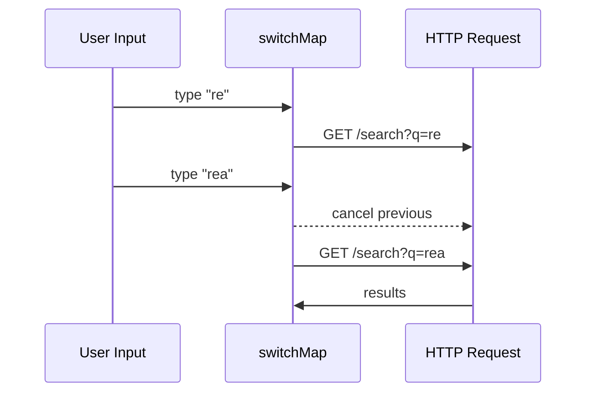

## Flow Diagram


```mermaid
sequenceDiagram
  participant U as User Input
  participant S as switchMap
  participant A as HTTP Request
  U->>S: type "re"
  S->>A: GET /search?q=re
  U->>S: type "rea"
  S-->>A: cancel previous
  S->>A: GET /search?q=rea
  A->>S: results
```
```
