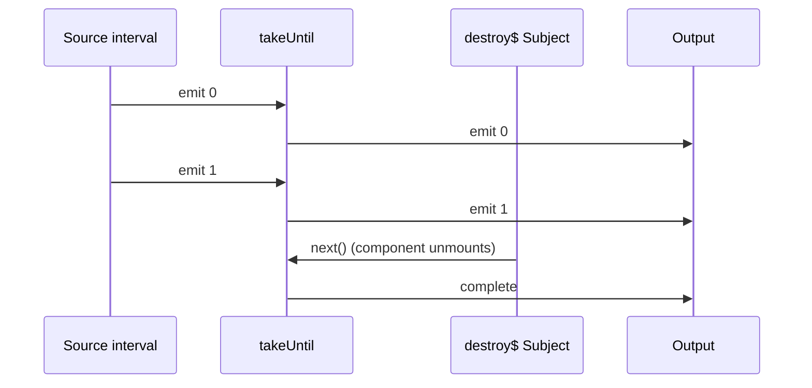

## Flow Diagram


```mermaid
sequenceDiagram
  participant S as Source interval
  participant T as takeUntil
  participant D as destroy$ Subject
  participant O as Output
  S->>T: emit 0
  T->>O: emit 0
  S->>T: emit 1
  T->>O: emit 1
  D->>T: next() (component unmounts)
  T->>O: complete
```
```
